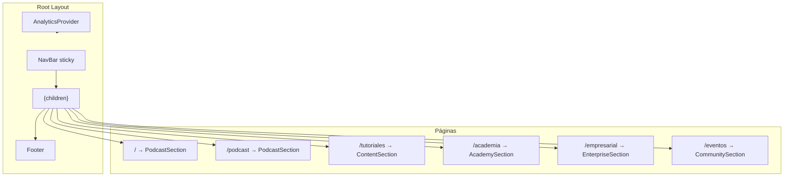

# Estructura UI — DevLokos Hub Web

Documentación de la arquitectura visual y de componentes del hub web DevLokos (Next.js 16 App Router).

**Última actualización:** Junio 2026

---

## Arquitectura general

El sitio es un **hub multi-página** con layout global compartido. Cada ruta renderiza una sección de contenido independiente.



---

## Layout global

**Archivo:** [`src/app/layout.tsx`](src/app/layout.tsx)

Responsabilidades:

- Metadata SEO (Open Graph, Twitter Cards, canonical)
- Fuente **Inter** vía `next/font/google`
- Tema oscuro (`className="dark"` en `<html>`)
- Estructura persistente:

```tsx
<html lang="es" className="dark">
  <body>
    <AnalyticsProvider>
      <NavBar />
      <main>{children}</main>
      <Footer />
    </AnalyticsProvider>
  </body>
</html>
```

NavBar y Footer **no** se repiten en cada página; viven en el layout raíz.

---

## Páginas y secciones

Cada página importa su sección dentro de `SECTION_PAGE_WRAPPER` ([`src/lib/section-layout.ts`](src/lib/section-layout.ts)):

```tsx
// Ejemplo: src/app/academia/page.tsx
<div className={SECTION_PAGE_WRAPPER}>
  <AcademySection />
</div>
```

| Ruta | Archivo | Sección | Descripción |
|------|---------|---------|-------------|
| `/` | `src/app/page.tsx` | `PodcastSection` | Episodios + JSON-LD |
| `/podcast` | `src/app/podcast/page.tsx` | `PodcastSection` | Igual que home |
| `/tutoriales` | `src/app/tutoriales/page.tsx` | `ContentSection` | Playlists + videos |
| `/academia` | `src/app/academia/page.tsx` | `AcademySection` | Cursos Firestore |
| `/empresarial` | `src/app/empresarial/page.tsx` | `EnterpriseSection` | Servicios + contacto |
| `/eventos` | `src/app/eventos/page.tsx` | `CommunitySection` | Eventos próximos/pasados |

### Clases de layout compartidas

| Constante | Valor | Uso |
|-----------|-------|-----|
| `SECTION_PAGE_WRAPPER` | `py-8 md:py-12` | Padding vertical de cada página |
| `SECTION_CONTAINER` | `max-w-7xl mx-auto px-4...` | Contenedor interno de secciones |

---

## Navegación

**Archivo:** [`src/components/NavBar.tsx`](src/components/NavBar.tsx)

- Sticky header con blur (`bg-black/80 backdrop-blur-md`)
- 5 enlaces: Podcast, Tutoriales, Academia, Empresarial, Eventos
- Logo enlaza a `/`
- Botón "Suscribirse" → YouTube
- Menú hamburguesa en mobile (Lucide `Menu` / `X`)
- Estado activo con `usePathname()`

---

## Componentes por módulo

### Podcast — `PodcastSection.tsx`

- Fetch a `/api/episodes`
- `SearchBar` + filtro por temporada (S1/S2)
- Grid de `EpisodeCard`
- Modal de video YouTube a pantalla completa
- Paginación client-side

### Tutoriales — `ContentSection.tsx`

- Fetch a `/api/tutorials/playlists` y `/api/tutorials/videos`
- Chips de playlists (excluye playlist del podcast)
- Búsqueda en memoria
- `TutorialCard` + modal de video

### Academia — `AcademySection.tsx`

- Fetch a `/api/courses`
- Filtros por dificultad y ruta de aprendizaje
- `CourseCard` con detalle expandible
- CTA inscripción vía WhatsApp

### Empresarial — `EnterpriseSection.tsx`

- Fetch a `/api/services` y `/api/portfolio`
- Formulario de contacto (Web3Forms desde cliente)
- Obtiene access key vía `/api/contact/config`

### Eventos — `CommunitySection.tsx`

- Fetch a `/api/events`
- Separa upcoming / past
- `EventCard` + modal de detalle

---

## Componentes compartidos

### Cards

| Componente | Uso |
|------------|-----|
| `EpisodeCard` | Episodios podcast |
| `TutorialCard` | Videos tutoriales |
| `CourseCard` | Cursos academia |
| `EventCard` | Eventos |

### UI (`src/components/ui/`)

| Componente | Uso |
|------------|-----|
| `button` | Botones con variantes CVA |
| `input` | Campos de formulario |
| `SearchBar` | Búsqueda con icono |
| `SectionIntro` | Título + descripción de sección |
| `EmptyState` | Estado vacío / error |

### Otros

| Componente | Uso |
|------------|-----|
| `Logo` | Logo en NavBar |
| `Footer` | Redes, email, links legales |
| `PrivacyPolicyModal` | Política de privacidad |
| `TermsModal` | Términos de servicio |
| `AnalyticsProvider` | Screen views + eventos Firebase |

---

## Componente legacy

**`HeroSection.tsx`** — Existe en el repositorio pero **no se importa en ninguna página**. Era parte de la landing original de una sola pantalla. Puede eliminarse o reutilizarse si se redefine la home.

---

## Patrones de implementación

### Client vs Server Components

- **Layout y páginas** — Server Components (metadata, JSON-LD)
- **Secciones (`*Section.tsx`)** — Client Components (`'use client'`) por interactividad (fetch, modales, búsqueda)

### Fetch de datos

```tsx
// Patrón típico en *Section.tsx
useEffect(() => {
  fetch('/api/episodes')
    .then(res => res.json())
    .then(data => setEpisodes(data.episodes));
}, []);
```

Las API routes manejan Remote Config, Firestore y YouTube server-side.

### Modales de video

Las secciones de podcast y tutoriales abren un overlay/modal con iframe o embed de YouTube al hacer clic en una card.

### Estilos

- **Tailwind CSS 4** con variables en `globals.css`
- Tema oscuro por defecto
- Color primario de marca (`primary` = naranja DevLokos)
- Mobile-first: breakpoints `sm`, `md`, `lg`

### Animaciones

- **Framer Motion** en transiciones de secciones y cards
- **`useScrollAnimation`** hook disponible para animaciones on-scroll

---

## Estructura de archivos UI

```
src/
├── app/
│   ├── layout.tsx          # Shell global
│   ├── page.tsx            # Home
│   ├── podcast/page.tsx
│   ├── tutoriales/page.tsx
│   ├── academia/page.tsx
│   ├── empresarial/page.tsx
│   ├── eventos/page.tsx
│   └── globals.css
├── components/
│   ├── NavBar.tsx
│   ├── Footer.tsx
│   ├── Logo.tsx
│   ├── PodcastSection.tsx
│   ├── ContentSection.tsx
│   ├── AcademySection.tsx
│   ├── EnterpriseSection.tsx
│   ├── CommunitySection.tsx
│   ├── HeroSection.tsx     # LEGACY — no usado
│   ├── EpisodeCard.tsx
│   ├── TutorialCard.tsx
│   ├── CourseCard.tsx
│   ├── EventCard.tsx
│   ├── AnalyticsProvider.tsx
│   ├── PrivacyPolicyModal.tsx
│   ├── TermsModal.tsx
│   └── ui/
│       ├── button.tsx
│       ├── input.tsx
│       ├── SearchBar.tsx
│       ├── SectionIntro.tsx
│       └── EmptyState.tsx
├── lib/
│   └── section-layout.ts
└── hooks/
    └── useScrollAnimation.ts
```

---

## Assets estáticos

Referenciados en metadata y componentes:

| Archivo | Uso |
|---------|-----|
| `public/logo.png` | Open Graph, Twitter Cards |
| `public/logo-transparent.png` | Logo en NavBar |
| `public/favicon.png` | Favicon |

> Estos archivos pueden no estar en el repositorio. Ver [GUIA_DEPLOYMENT.md](GUIA_DEPLOYMENT.md) para instrucciones de assets.

---

## Documentación relacionada

- [README.md](README.md) — Overview del proyecto
- [docs/TUTORIALES_CONEXION.md](docs/TUTORIALES_CONEXION.md) — Integración técnica Tutoriales
- [GUIA_DEPLOYMENT.md](GUIA_DEPLOYMENT.md) — Deploy y variables de entorno
