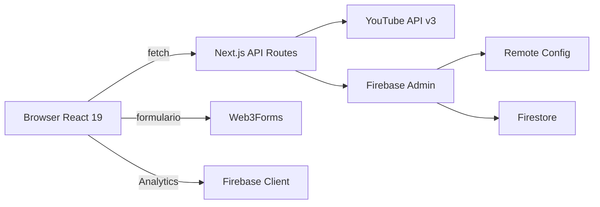

# DevLokos Hub Web

Hub web oficial de **DevLokos** — comunidad de desarrolladores y creadores tech en Latinoamérica. Sitio multi-página que centraliza podcast, tutoriales, academia, servicios empresariales y eventos, alineado con la app móvil.

**App móvil complementaria:** [DevLokosDart](https://github.com/KevinhoMorales/DevLokosDart)

**Versión:** `0.1.0` · **Proyecto Firebase:** `devlokos` · **Dominio:** [devlokos.com](https://devlokos.com)

---

## Módulos y rutas

| Ruta | Componente | Fuente de datos |
|------|------------|-----------------|
| `/` | `PodcastSection` | YouTube (playlist podcast) |
| `/podcast` | `PodcastSection` | YouTube |
| `/tutoriales` | `ContentSection` | YouTube (playlists del canal) |
| `/academia` | `AcademySection` | Firestore `courses` |
| `/empresarial` | `EnterpriseSection` | Firestore `services` / `portfolio` + Web3Forms |
| `/eventos` | `CommunitySection` | Firestore `events` |

La home (`/`) muestra el podcast directamente (equivalente funcional a `/podcast`).

---

## Stack tecnológico

| Categoría | Tecnología |
|-----------|------------|
| Framework | Next.js **16.0.10** (App Router) |
| UI | React **19.2.0**, TypeScript **5** |
| Estilos | Tailwind CSS **4**, Framer Motion |
| Componentes | Radix UI, CVA, Lucide React |
| Backend server | Firebase Admin SDK (Remote Config + Firestore) |
| Cliente | Firebase JS SDK (Analytics) |
| APIs externas | YouTube Data API v3, Web3Forms |
| Fuente | Inter (Google Fonts) |

---

## Inicio rápido

```bash
git clone https://github.com/KevinhoMorales/DevLokosTypeScript.git
cd DevLokosTypeScript
npm install
cp .env.example .env.local
# Editar .env.local con tus credenciales
npm run dev
```

Abre [http://localhost:3000](http://localhost:3000).

Reinicia el servidor después de cambiar variables de entorno.

---

## Variables de entorno

Copia [`.env.example`](.env.example) a `.env.local`. Resumen por módulo:

| Variable | Módulo | Obligatoriedad |
|----------|--------|----------------|
| `YOUTUBE_API_KEY` | Podcast, Tutoriales | Obligatoria* |
| `YOUTUBE_PLAYLIST_ID` | Podcast | Recomendada |
| `YOUTUBE_CHANNEL_ID` o `YOUTUBE_TUTORIALS_PLAYLIST_ID` | Tutoriales | Al menos una |
| `FIREBASE_ADMIN_SDK_KEY` | Academia, Eventos, Empresarial | Obligatoria |
| `FIREBASE_ENV` | Firestore (`prod` / `dev`) | Opcional (default: `prod`) |
| `NEXT_PUBLIC_FIREBASE_*` | Analytics | Recomendadas |
| `NEXT_PUBLIC_WEB3FORMS_ACCESS_KEY` | Formulario Empresarial | Recomendada |
| `NEXT_PUBLIC_SITE_URL` | SEO / metadata | Opcional |

\* También puede obtenerse desde Firebase Remote Config (`youtube_api_key`).

### Remote Config (servidor)

Parámetros soportados en Firebase Remote Config:

- `youtube_api_key`
- `youtube_playlist_id`
- `youtube_channel_id`
- `youtube_tutorials_playlist_id`
- `web_3_form`

Prioridad: Remote Config → variable de entorno → error descriptivo.

---

## Scripts

```bash
npm run dev      # Servidor de desarrollo
npm run build    # Build de producción
npm run start    # Servidor de producción
npm run lint     # ESLint
```

---

## Estructura del proyecto

```
src/
├── app/
│   ├── layout.tsx              # NavBar + Footer + AnalyticsProvider
│   ├── page.tsx                # Home → Podcast
│   ├── podcast/                # Podcast
│   ├── tutoriales/             # Tutoriales
│   ├── academia/               # Academia
│   ├── empresarial/            # Empresarial
│   ├── eventos/                # Eventos
│   ├── api/                    # 9 endpoints REST
│   └── globals.css
├── components/
│   ├── *Section.tsx            # Sección por módulo
│   ├── *Card.tsx               # Episode, Tutorial, Course, Event
│   ├── ui/                     # button, input, SearchBar, SectionIntro...
│   ├── AnalyticsProvider.tsx
│   └── modales legales
├── lib/
│   ├── firebase-admin.ts       # Admin SDK + Remote Config
│   ├── firebase.ts             # Cliente + Analytics
│   ├── firestore-helpers.ts    # Rutas Firestore por ambiente
│   ├── youtube.ts              # YouTube API helpers
│   ├── analytics.ts            # Eventos alineados con app móvil
│   └── section-layout.ts       # Clases compartidas de layout
└── hooks/
    └── useScrollAnimation.ts
```

---

## Arquitectura

### Layout global

[`src/app/layout.tsx`](src/app/layout.tsx) envuelve todas las páginas:

```
NavBar (sticky)
  └── {children}   ← cada ruta renderiza su *Section
Footer
AnalyticsProvider
```

### Flujo de datos



1. Las páginas (client components) hacen `fetch` a `/api/*`
2. Las API routes obtienen credenciales vía Remote Config o `.env.local`
3. YouTube alimenta podcast y tutoriales; Firestore alimenta academia, eventos y empresarial
4. El formulario empresarial envía preferentemente desde el navegador vía Web3Forms

---

## API Routes

| Endpoint | Método | Fuente | Descripción |
|----------|--------|--------|-------------|
| `/api/episodes` | GET | YouTube | Episodios del podcast |
| `/api/tutorials/playlists` | GET | YouTube | Playlists del canal |
| `/api/tutorials/videos` | GET | YouTube | Videos de una playlist |
| `/api/courses` | GET | Firestore | Cursos publicados |
| `/api/events` | GET | Firestore | Eventos activos |
| `/api/services` | GET | Firestore | Servicios empresariales |
| `/api/portfolio` | GET | Firestore | Portfolio |
| `/api/contact` | POST | Web3Forms | Envío desde servidor |
| `/api/contact/config` | GET | Remote Config / env | Key para envío cliente |

### Firestore

Rutas según `FIREBASE_ENV` (default `prod`):

```
{env}/{env}/courses/{id}
{env}/{env}/events/{id}
services/          (raíz)
portfolio/         (raíz)
```

---

## Características

- **NavBar** responsive con 5 módulos + botón Suscribirse (YouTube)
- **Búsqueda** client-side en podcast, tutoriales y academia
- **Modales de video** YouTube embebidos
- **Formulario empresarial** con Web3Forms (cliente preferido)
- **Firebase Analytics** — eventos alineados con la app móvil
- **SEO** — metadata, Open Graph, Twitter Cards, JSON-LD, `robots.txt`
- **Tema oscuro** por defecto

---

## Deployment

Ver [GUIA_DEPLOYMENT.md](GUIA_DEPLOYMENT.md) para instrucciones detalladas (Vercel + GoDaddy recomendado).

Resumen:

1. Push a GitHub
2. Importar en Vercel
3. Configurar todas las variables de `.env.example`
4. Conectar dominio y verificar SSL

---

## Documentación relacionada

| Documento | Contenido |
|-----------|-----------|
| [ESTRUCTURA_UI.md](ESTRUCTURA_UI.md) | Arquitectura UI y componentes |
| [GUIA_DEPLOYMENT.md](GUIA_DEPLOYMENT.md) | Deploy Vercel / Netlify / VPS |
| [docs/TUTORIALES_CONEXION.md](docs/TUTORIALES_CONEXION.md) | Integración técnica Tutoriales |

---

## Pendientes conocidos

- Assets `logo.png`, `logo-transparent.png`, `favicon.png` referenciados pero no incluidos en `public/` del repo
- `robots.txt` apunta a `sitemap.xml` — pendiente implementar `src/app/sitemap.ts`
- `HeroSection.tsx` existe pero no se usa en ninguna ruta (legacy)
- Sin suite de tests automatizados (solo `npm run lint`)
- Sin CI/CD

---

## Licencia

Proyecto privado y propietario.

**Mantenido por:** DevLokos Team

**Última actualización:** Junio 2026
